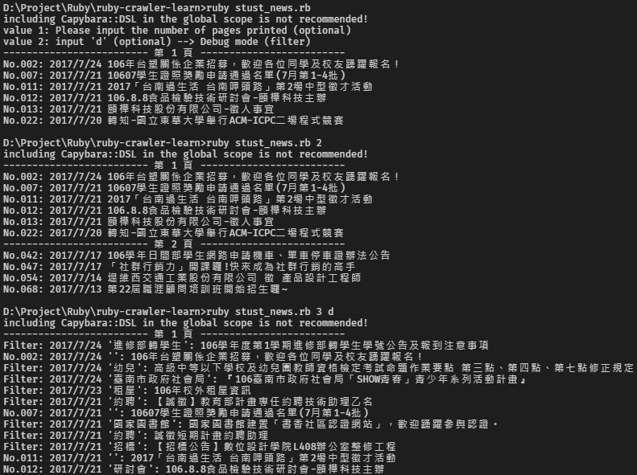

# ruby-crawler-learn (Ruby 爬蟲)

## Install gem package
```shell
$ bundle
```

## Install phantomjs
###  Linux
```shell
$ sudo gem install poltergeist
$ whereis phantomjs // 或 which phantomjs

執⾏結果會指出系統內的 phantomjs 在什麼位置，例如：/usr/local/bin/phantomjs
如果沒有 phantomjs 請進⾏下面的操作

// Download the 32 bit or 64 bit binary
$ wget https://bitbucket.org/ariya/phantomjs/downloads/phantomjs-2.1.1-linux-x86_64.tar.bz2

// Extract the tarball and copy bin/phantomjs into your PATH
// 解壓縮 .tar.bz2
$ tar jxvf phantomjs-2.1.1-linux-x86_64.tar.bz2
$ cd phantomjs-2.1.1-linux-x86_64/bin
$ sudo cp phantomjs /usr/local/bin
$ whereis phantomjs
```

### Mac (3 選 1 即可)
- Homebrew：`$ brew install phantomjs`
- MacPorts：`$ sudo port install phantomjs`
- Manual install： [Download this](https://bitbucket.org/ariya/phantomjs/downloads/phantomjs-1.9.8-macosx.zip) (1.9.8)

### Windows
```shell
$ gem install poltergeist
```
1. 下載並解壓縮 phantomjs： [http://phantomjs.org/download.html](http://phantomjs.org/download.html)
2. 將 phantomjs 放在 `D:\` 位置，例如：`D:\phantomjs-2.1.1-win\bin`
3. 將 phantomjs 目錄加入環境變數 Path
4. 確認是否設定成功
```shell
$ phantomjs -v
2.1.1
```

## Run
```
$ ruby stust_news.rb
```

## Whoscall crawler
Source code: [Whoscall crawler](./whoscall.rb)


---

## STUST News crawler (南臺科技大學 最新消息 爬蟲)
Source code: [STUST News crawler](./stust_news.rb)

